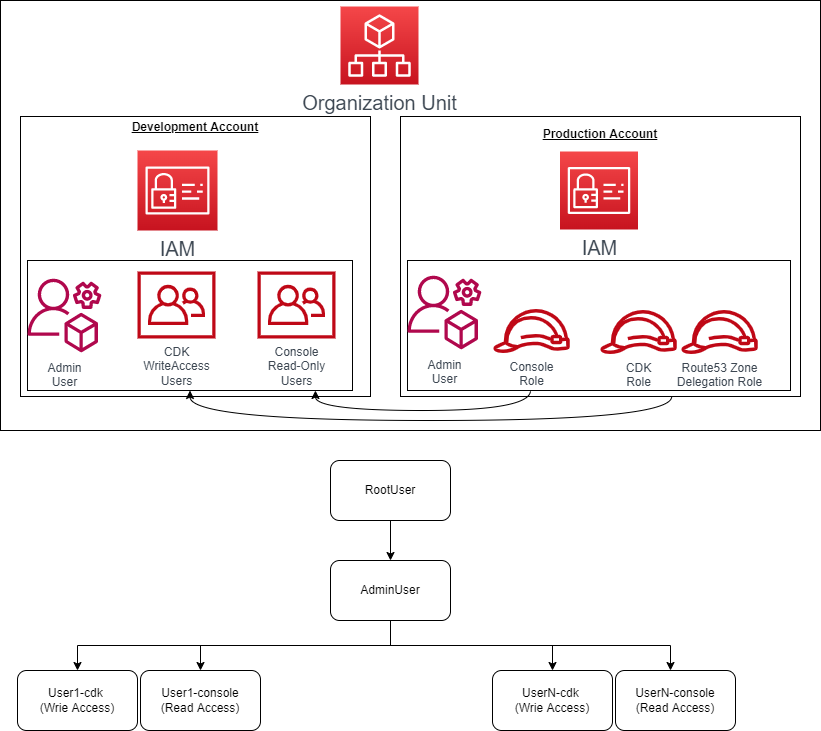
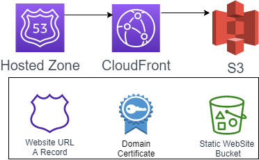

# Overview
Assuming 80% of our use cases can be addressed using 20% of what cloud technologies provides, this repository is aimed at decomposing and codifying the relevant 20% using AWS Cloud Development Kit (CDK) in TypeScript.

AWS breaks down its services and tools here https://docs.aws.amazon.com/. The repository though is structured around a very opinionated functional breakdown, which I believe also allows for a fair use case based comparison across various infrastructure vendors. These functions/use cases are implemented as AWS CDK Stacks that are independently configurable, and for each environment (dev, prod).

The full list of stacks with AWS resources used in each:
* Access Management (IAM)
* Domain Management (Route53, SES, Certificate Manager)
* Static Site (CloudFront, S3 and Route53 Alias Record)
* User Management (Cognito, API Gateway JWT Authorizer, Lambdas)

All stacks have coupling between them. However, breaking down prevents a monolithic implementation, and promotes reusability. Specifically, we can have Applications can pick and choose the CDK stacks that are relevant to them to stand-up their application.

Finally, some stacks like Access and Domain Management also have coupling across environments to allow for simple and secure software development lifecycle.

## One-time Manual Steps
1. Root user creates a `xxx-dev` account, and `xxx-prod` account under single organization.
2. Root user creates admin user with programmatic access in each account, and saves credentials as `dev-admin` and `prod-admin` AWS profiles.
3. Root user bootstraps each of the accounts, and each of the regions by running these commands:
    ```
    CDK_NEW_BOOTSTRAP=1 npx cdk bootstrap --profile dev-admin aws://{dev-account-id}/{region}
    CDK_NEW_BOOTSTRAP=1 npx cdk bootstrap --profile prod-admin aws://{prod-account-id}/{region}
    ```
4. Root user should configure cost thresholds and alerting on the billing console for each account.

## General CDK Commands
Install `node` and `aws`, and run `npx cdk <command>`. 
* `synth` - to create a cloudformation template
* `diff` - to diff against the currently deployed template 
* `deploy` - to deploy the stack
* `destroy` - to destroy the stack

The environment is passed as `ENV` variable, and the user as `--profile` parameter. Please refer to CDK docs for more details.

## Access management stack
Creates roles in `prod` account, and assigns these roles to users that it creates in `dev` account. There is coupling across environments in this stack because the roles created in prod environment are assigned to the users configured for dev environment.

```
ENV=Production npx cdk deploy --profile prod-admin AccessManagement
ENV=Development npx cdk deploy --profile dev-admin AccessManagement
```
The admin user deploys this stack. There are two types of users created for each username configured. A `*-cdk` user with programmatic write access with no UI access, and `*-console` user with read access only. This is to encourage all changes to infrastructure happen programmatically, and never using the console.

Save the cdk users credential as `dev` and `prod` AWS profiles. Sample  `~/.aws/credentials` file:
```
[dev]
aws_access_key_id = ABCDEFGHIZJKLMNOPQRZ
aws_secret_access_key = abcdefghiklmnopqrstuvwxyz123

[prod]
role_arn = arn:aws:iam::{production_aws_account_id}:role/ProductionCdkRole
source_profile = dev0
```

## Domain management stack
Creates Route53 zones and an API Gateway in `prod` and `dev` for all other stacks to share. The NS record from `prod` hosted zone need to be manually copied to Domain Registrar for the very first deploy to complete.

```
ENV=Production npx cdk deploy --profile prod DomainManagement
ENV=Development npx cdk deploy --profile dev DomainManagement
```
The `dev` URL is configured as a subdomain of the `prod` URL i.e. `dev.example.com` and `example.com`. The `api` URL is configured as subdomain of these i.e. `api.dev.example.com` and `api.example.com`. There is coupling across environments in this stack because the hosted zone created in prod environment is used to store a pointer to the NS records created in dev environment.


### Manual steps to configure SES domain and identities
1. For authentication of SES emails, verify your domain using the SES console in each account, which will automatically add records to Route 53. Capture these records in code by adding to domain management configs.
2. Add verified senders in SES. For ex: `no-reply@example.com` in prod, and `no-reply@dev.example.com` in non-prod accounts.
3. If your account is in the SES sandbox environment, you can only send emails to verified email addresses. To get your account out of the test environment, open a ticket with AWS support on the SES page. 

## Static site stack
Creates the infrastructure for a static site, which uses an S3 bucket for storing the content using a CloudFront distribution and an alias record in the domains Hosted Zone deployed using domain management stack.

```
ENV=Development npx cdk deploy --profile dev StaticSite
ENV=Production npx cdk deploy --profile prod StaticSite
```

## User management stack
Creates the infrastructure for user management using Cognito User pools, Lambda functions to CRUD the users and JWT Authorizer for the Http API deployed on API Gateway.

```
ENV=Development npx cdk deploy --profile dev UserManagement
ENV=Production npx cdk deploy --profile prod UserManagement
```

## Resource management stack
Creates the infrastructure for resource management using DynamoDB and Lambda functions to CRUD the resources.

```
ENV=Development npx cdk deploy --profile dev ResourceManagement
ENV=Production npx cdk deploy --profile prod ResourceManagement
```
All endpoints share 4 Lambda functions to CRUD resources into independently configurable DynamoDB tables.

## Contributing
Community contributions and pull requests are welcomed, but beware of zero automation's and testing. So please test manually and run linter. Also, always scrub the `/cfg` folder files before committing. The secrets in there need to be moved to AWS secrets manager.
